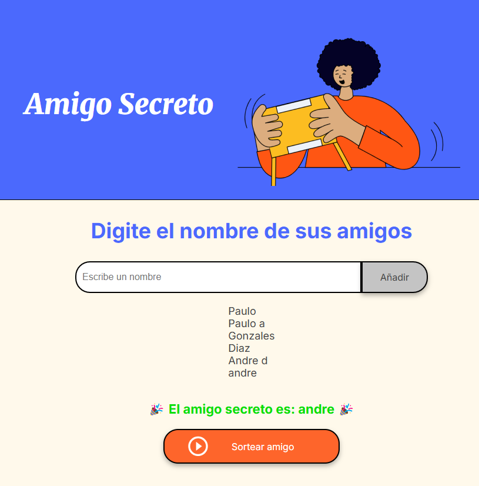

🎁 Amigo Secreto

¡Bienvenido al proyecto de Amigo Secreto! Este es un pequeño pero divertido programa en JavaScript que te permite agregar nombres a una lista y realizar un sorteo aleatorio para elegir al "amigo secreto".

🚀 Funcionalidades

  ✅ Agregar nombres a la lista.
  ✅ Evitar nombres duplicados (independiente de mayúsculas y minúsculas).
  ✅ Permitir nombres distintos si hay una diferencia significativa (Ej: "Paulo" y "Paulo A").
  ✅ Mostrar la lista de amigos agregados.
  ✅ Realizar un sorteo aleatorio y mostrar el nombre del amigo secreto.

📸 Capturas de pantalla

🔹 Agregar nombres

🔹 Realizar el sorteo

📜 Instrucciones de uso

   1️⃣ Clona este repositorio o descarga los archivos.

       git clone https://github.com/Slappy10/desafio-amigo-secreto.git

  2️⃣ Abre el archivo index.html en tu navegador.

  3️⃣ Ingresa los nombres en el campo de texto y presiona "Añadir".

  4️⃣ Una vez agregados los participantes, presiona "Sortear amigo" para elegir al amigo secreto. 🎉

📂 Estructura del proyecto

  📂 amigo-secreto
 
    ├── 📂 assets # Recursos multimedia (imágenes, íconos, etc.)
    │   ├── 🖼️ amigo-secreto.png
    │   ├── 🖼️ image-1.png
    │   ├── 🖼️ image.png
    │   ├── 🖼️ play_circle_outline.png
    ├── 📄 app.js      # Lógica del programa
    ├── 📄 index.html  # Interfaz principal
    ├── 📄 README.md   # Documentación
    ├── 📄 styles.css  # Estilos

🛠 Tecnologías utilizadas

   HTML

   CSS 

   JavaScript 

📌 Mejoras futuras

  🔹 Mejorar la interfaz con CSS avanzado.
  🔹 Permitir exportar la lista de participantes.
  🔹 Agregar una opción para reiniciar la lista.
  🔹 Implementar una versión en React o Vue.js.

🎯 Contribuciones

¡Las contribuciones son bienvenidas! Si deseas mejorar este proyecto, siéntete libre de hacer un fork y enviar un pull request. 😃

📄 Licencia

Este proyecto está bajo la licencia MIT. Puedes usarlo y modificarlo libremente.

📌 Hecho con ❤️ por Paulo Gonzáles Díaz